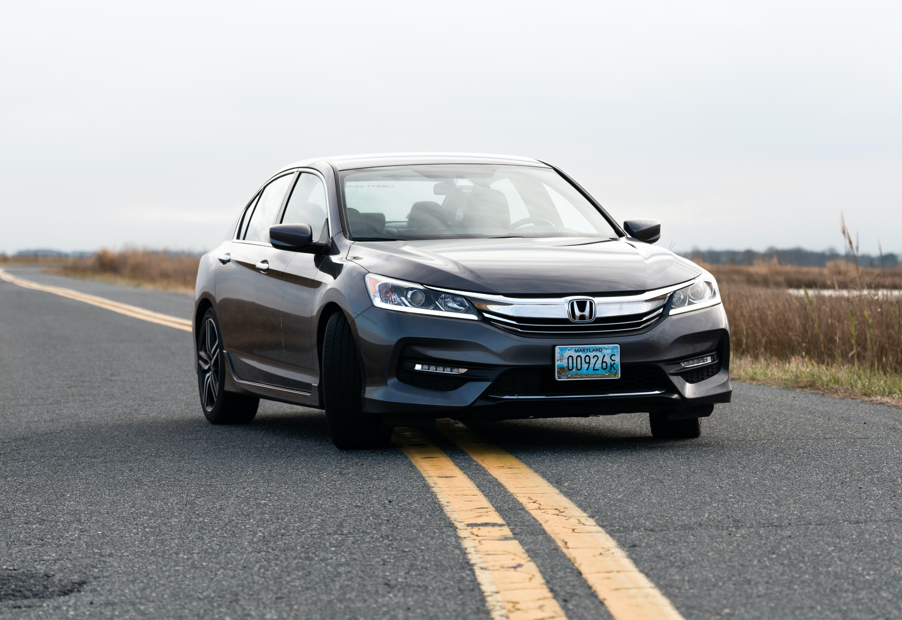

this is a normal text 

# Vehicles

## Cars

There are different types of cars:

1. ### hatchback
    blah blah blah  
    These are made by companies like [Honda](https://www.honda.com.au), [Toyota](https://toyota.com.au)

2. ### Sedan
    Sedan is a car that looks like below  
    

    ## Bicycles

    I am typing a text 

    another text

    - this is number 1
        - this is a sub-point
            - this is further sub-point 
    - this is point number 2 

    > this is a quote from somewhere else 
    >> this is further sub-quote from the quote above

  
  ## Codes

  `hello`

```
print("Hello World")
print("Hello another world)
```

```py
print("Hello World")
print("Hello anther world")
```

# DemoProject
# DemoProject
# DemoProject
# DemoProject
